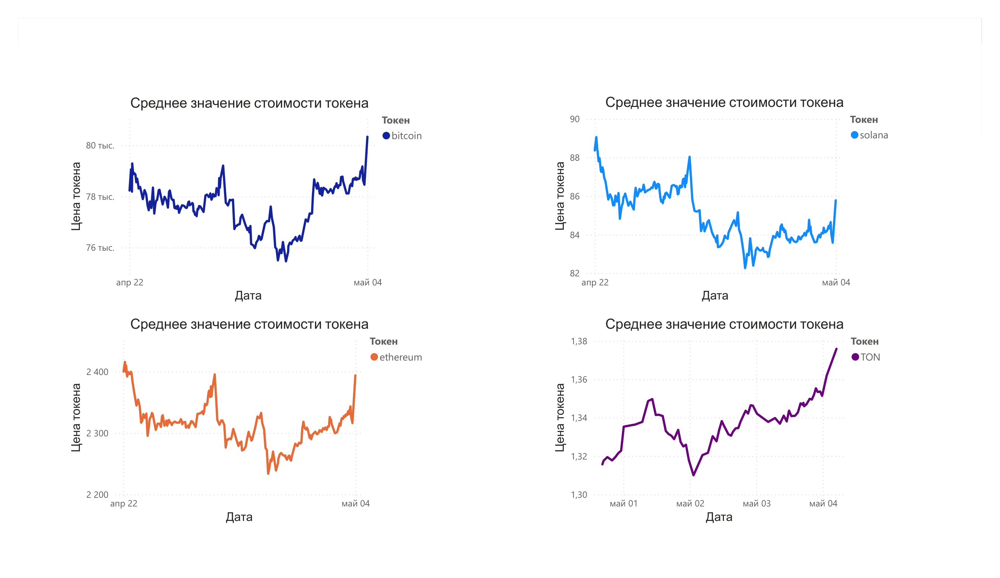

# Crypto-ETL-pipeline

Минималистичный ETL-пайплайн для мониторинга цен токенов.

## ETL:
1. **Extract**: Получает данные из **CoinGecko API** (`requests`).
2. **Transform**: Формирует структуру данных с меткой времени (`pandas`).
3. **Load**: Сохраняет результат в облачный **PostgreSQL (Neon)**.

## Оркестрация и Автоматизация:
Пайплайн полностью автоматизирован с помощью **GitHub Actions**.

- **Расписание**: Скрипт запускается автоматически каждые 10 минут (по cron).

## Стек:
Python, Pandas, Psycopg2, PostgreSQL (Neon).

## Быстрый старт:
1. Настройте ключи в `.env`:
   ```env
   API_KEY=your_coingecko_key
   DB_PASS=your_neon_password
2. Установите зависимости:
   ```bash
   pip install requests pandas psycopg2-binary python-dotenv
   
3. Запустите:
   ```bash
   python src/etl.py

## Схема таблицы:
   coins_price (id SERIAL PRIMARY KEY, date TIMESTAMP, price FLOAT, coin VARCHAR(10))

## Визуализация данных
Дашборд в Power BI отображает динамику курсов криптовалют.



