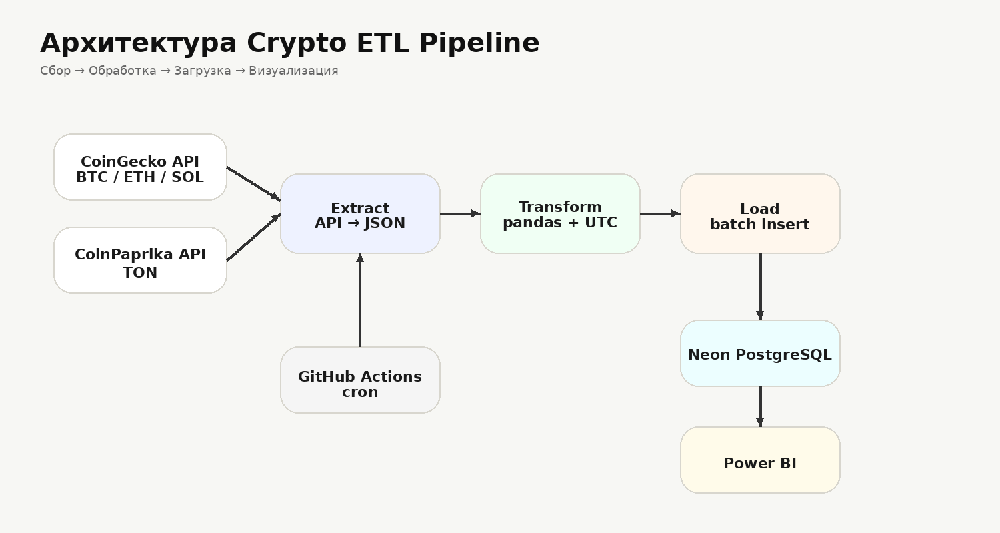
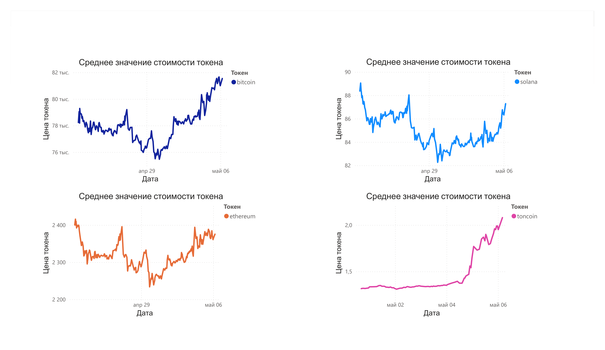

# Crypto-ETL-Pipeline


ETL-пайплайн для мониторинга криптовалютных токенов с автоматической загрузкой данных в PostgreSQL и визуализацией в Power BI.

```text
REST API → Extract → Transform → Load → PostgreSQL → Power BI
```

---

# Архитектура решения (ETL)



---

# Как работает pipeline

## 1. Extract (Извлечение)

Получение данных из нескольких REST API:

- CoinGecko API
  - BTC
  - ETH
  - SOL

- CoinPaprika API
  - TON

- CoinLore API
  - BTC метаданные
  - market_cap_usd
  - percent_change_24h
  - percent_change_7d

Используется:
- `requests`

---

## 2. Transform (Трансформация)

Обработка выполняется через `pandas`.

Pipeline:
- нормализует JSON-структуры;
- приводит типы данных;
- добавляет UTC timestamp;
- добавляет поле `source`;
- подготавливает данные для batch insert.

Используется:
- `datetime(timezone.utc)`
- `pandas.DataFrame`

---

## 3. Load (Загрузка)

Данные загружаются в облачный PostgreSQL (Neon).

Особенности загрузки:

- batch insert через `execute_values`
- идемпотентная загрузка
- `ON CONFLICT DO NOTHING`
- `UNIQUE` constraints
- context manager для подключения

Используется:
- `psycopg2`
- `psycopg2.extras.execute_values`

---

# Автоматизация и Оркестрация

Pipeline полностью автоматизирован через GitHub Actions.

Возможности:

- cron (каждые 2 часа)
- автоматический запуск ETL
- централизованные логи pipeline

GitHub Actions используется как оркестратор вместо Airflow.

---

# Дашборд и Визуализация

Данные подключаются к Power BI напрямую из PostgreSQL (Neon).

Dashboard отображает:

- динамику цен криптовалют;
- изменение цены во времени;
- сравнение токенов.

## Dashboard Preview



---

# Технологический стек

| Категория | Инструменты |
| :--- | :--- |
| Язык | Python 3.12 |
| Data Processing | Pandas |
| API | REST API / JSON |
| База данных | PostgreSQL (Neon) |
| Visualization | Power BI |
| Containerization | Docker |
| Automation | GitHub Actions |


# Структура БД

Проект использует несколько таблиц для хранения данных из разных источников.

## 1. public.coins_price

Основная таблица со спотовыми ценами криптовалют из:

- CoinGecko API
- CoinPaprika API

Используется для:
- хранения исторических цен;
- визуализации в Power BI;
- сравнительного анализа токенов.

### Поля таблицы

```sql
id SERIAL PRIMARY KEY
date TIMESTAMP
price DOUBLE PRECISION
coin VARCHAR(10)
source VARCHAR(25)
```

### Идемпотентность

Для предотвращения дублей используется:

```sql
UNIQUE(source, coin, date)
```

---

## 2. raw.coin_lore

Raw-таблица для расширенных market metrics из CoinLore API.

Используется для:
- хранения market data;
- анализа капитализации;
- анализа изменения цены за 24h / 7d;
- дальнейшего расширения DWH-слоя.

### Поля таблицы

```sql
id SERIAL PRIMARY KEY
date TIMESTAMP WITH TIME ZONE
nameid VARCHAR(15)
price DOUBLE PRECISION
percent_change_24h DOUBLE PRECISION
percent_change_7d DOUBLE PRECISION
market_cap_usd NUMERIC(25,2)
source VARCHAR
```

---


# Быстрый старт

## 1. Клонируйте репозиторий

```bash
git clone https://github.com/affection7/crypto-etl-pipeline.git
cd crypto-etl-pipeline
```

---

## 2. Создайте `.env`

```env
API_KEY=your_coingecko_api_key

URL_GECKO=https://api.coingecko.com/api/v3/simple/price?vs_currencies=usd&ids=bitcoin,ethereum,solana

URL_PAPRIKA=https://api.coinpaprika.com/v1/tickers/ton-toncoin

URL_COINLORE=https://api.coinlore.net/api/tickers/

DATABASE_URL=your_neon_database_url
```

---

## 3. Установите зависимости

```bash
pip install -r requirements.txt
```

---

## 4. Запустите ETL pipeline

### Локально

```bash
python src/main.py
```

### Через Docker

```bash
# Сборка образа
docker build -t etl-coin .

# Запуск контейнера
docker run --env-file .env etl-coin
```

---
